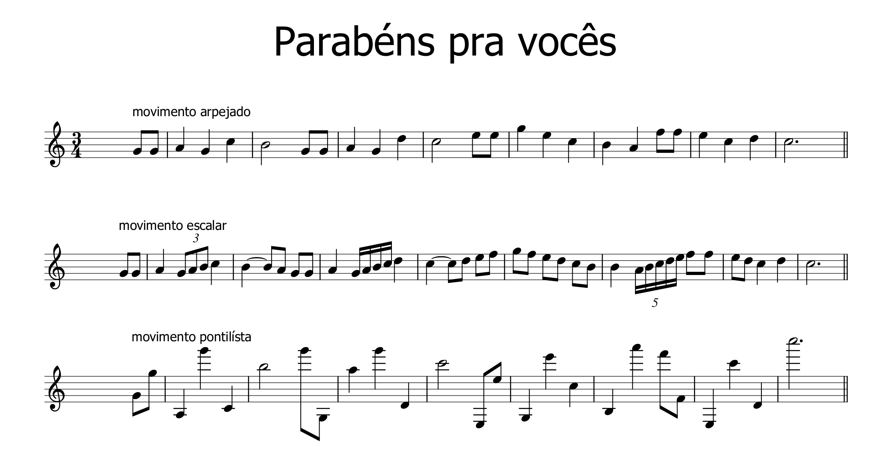
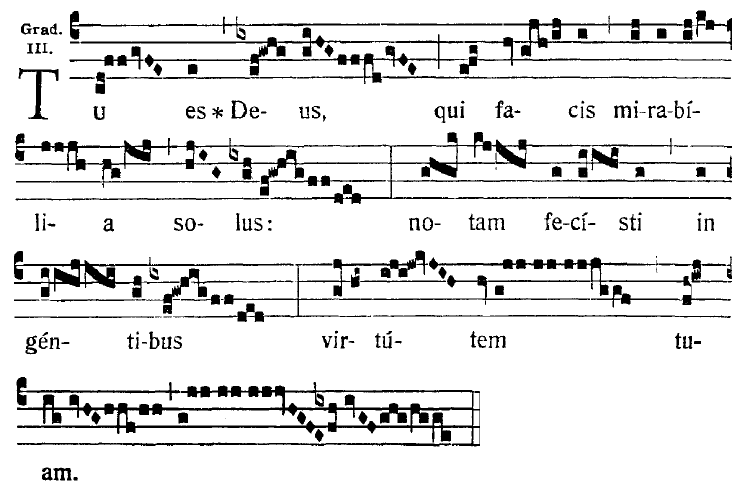
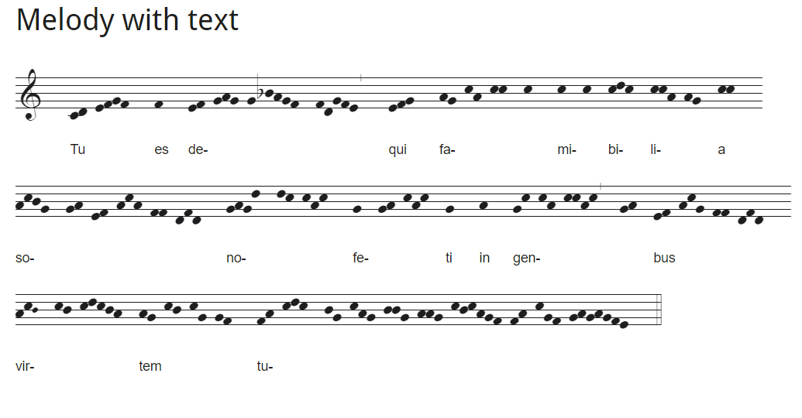
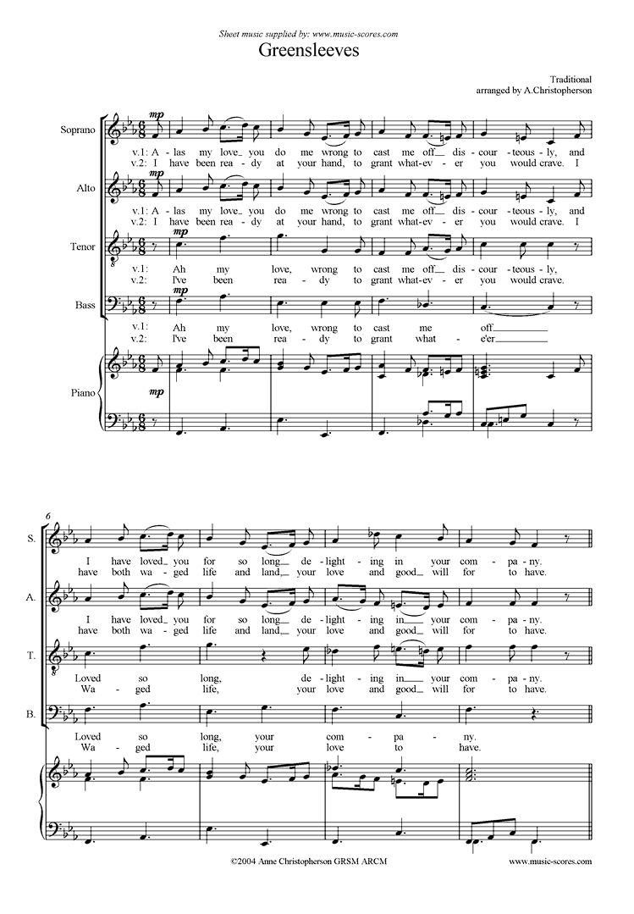

# aula 01 - roteiro

# o que é melodia?

#### definição de dicionário:

> Melodia, definida como sons com **alturas definidas** organizadas em um tempo musical de acordo com as convenções e restrições de uma dada cultura, representa um fenômeno universal observável desde a pré-história; em algumas culturas, no entanto, considerações rítmicas podem ter sempre uma precedência ante expressões melódicas, como em partes da África onde sons percussivos sem altura definida são empregados com função semântica da fala, ou como um pulso para atividades de esforço físico (seja no trabalho diário ou em danças ritualísticas), ou ambos. Os primeiros uso da melodia parecem estar relacionados com formas de comunicação social verbal, mas num contexto anterior, pré-verbal.
>
> **Dicionário Grove**

#### consenso geral:

> A melodia é uma sucessão de sons de alturas e valores diferentes, que obedece a um sentido lógico
>
> Compêndio de teoria elementar da música, **Osvaldo Lacerda**

> Uma melodia é uma coleção de notas musicais que são agrupadas em conjunto como uma única entidade.
>
> *site* [Masterclass](https://www.masterclass.com/articles/music-101-what-is-melody#how-is-melody-used-in-music-today)

#### citação do artigo da Wikipedia:

> As melodias existem na maioria das músicas europeias escritas antes do século XX, e na música popular ao longo do século XX, apresentam "padrões de frequência fixos e facilmente discerníveis", "eventos recorrentes, frequentemente periódicos, em todos os níveis estruturais" e "recorrência de durações e padrões de durações"
>
> [artigo sobre melodia - *em inglês*](https://en.wikipedia.org/wiki/Melody)

#### resumo:

> **melodia é tudo o que pode ser nãnanizavel!**

#### Curiosidade [Wikitionary]([https://en.wiktionary.org/wiki/%CE%BC%CE%AD%CE%BB%CE%BF%CF%82](https://en.wiktionary.org/wiki/μέλος))

> **μέλος** [•](https://en.wiktionary.org/wiki/Wiktionary:Ancient_Greek_transliteration) (mélos) *n* (*genitivo* **[μέλους](https://en.wiktionary.org/wiki/μέλους#Ancient_Greek)** *ou* **[μέλεος](https://en.wiktionary.org/wiki/μέλεος#Ancient_Greek)**); *[terceira declinação](https://en.wiktionary.org/wiki/Appendix:Ancient_Greek_third_declension)*
>
> 1. parte de um corpo, [galho](https://en.wiktionary.org/wiki/limb), [membro](https://en.wiktionary.org/wiki/member), [parte](https://en.wiktionary.org/wiki/part)
> 2. parte de um grupo, [membro](https://en.wiktionary.org/wiki/member)
> 3. [canção](https://en.wiktionary.org/wiki/song), [seção](https://en.wiktionary.org/wiki/strain)
> 4. [pequena composição](https://en.wiktionary.org/wiki/tune)
> 5. [melodia](https://en.wiktionary.org/wiki/melody)

---

# Fisiologia

antigamente tínhamos uma teoria geral chamada [Teoria dos afetos](https://historiadamusica2011.blogspot.com/2011/07/teoria-dos-afetos-teoria-dos-afetos.html) onde haviam figuras retóricas para dar sentido musical em relação ao texto cantado nas melodias. hoje em dia ainda temos essas [regras atreladas à poesia]([https://blog.holistic-songwriting.com/2016/03/13/3-types-of-melodies-you-must-know-tech/#:~:text=Remember%20these%20key%20differences%3A,every%20one%20or%20two%20bars](https://blog.holistic-songwriting.com/2016/03/13/3-types-of-melodies-you-must-know-tech/#:~:text=Remember these key differences%3A,every one or two bars)) 

a meu ver as melodias em geral possuem três tipos de características:

- arpejada - notas salteadas pela escala
- escalar - *notas por passo, ou grau conjunto*
- pontilista - *notas em diferentes registros*

[link no Musescore](https://musescore.com/user/114360/scores/6268086)

<iframe width="100%" height="600" src="https://musescore.com/user/114360/scores/6268086/s/DtBd1A/embed" frameborder="0" allowfullscreen allow="autoplay; fullscreen"></iframe>

<a href="https://musescore.com/user/114360/scores/6268086/s/pkjONm" target="_blank">parabens_pra_vocês</a> by <a href="https://musescore.com/user/114360">PandaCosta</a>

---

# Registros

as melodias então são baseadas em notas definidas. chamamos as notas definidas de [escala diastêmica](https://www.tandfonline.com/doi/full/10.1080/09298215.2019.1642360) que é a definição das alturas de sons com os nomes que conhecemos hoje: Dó | Ré | Mi | Fá | Sol | Lá | Si. essa notação foi atribuída a [Guido D'Arezzo](https://en.wikipedia.org/wiki/Guido_of_Arezzo) como uma padronização dos cantos na igreja com a substituição do sistema [neumático](https://en.wikipedia.org/wiki/Neume).

> #### tu es deus qui facis mirabilia a solus
>
> 
>
> 
>
>  
>
> 
>
> [canto gregoriano - YouTube](https://www.youtube.com/watch?v=n-2smpE2Lh0)
>
> <iframe width="560" height="315" src="https://www.youtube.com/embed/n-2smpE2Lh0" frameborder="0" allow="accelerometer; autoplay; encrypted-media; gyroscope; picture-in-picture" allowfullscreen></iframe>

a partir daí começaram então a amadurecer as noções de **afinação** e **polifonia**. começou a necessidade de usar uma **escala diatônica** para organizar mais ainda o "afeto" das músicas.

---

# Polifonia

várias melodias cantadas juntas. ponto.

com isso começou então a organização entre vozes graves e agudas *cantus firmus, tenores e afins* culminando na organização binária das vozes em feminina e masculina em grave e aguda, estamos fazendo um belo salto histórico:

**SATB**

- **soprano** - *clave de Sol*
- **alto** - *clave de Sol*
- **tenor** - *clave de ~~Dó~~ Sol oitava a baixo*
- **baixo**  - *clave de Fá*

​						fonte: [music-scores.com](https://www.music-scores.com/midi.php?sheetmusic=Trad_Greensleeves_SATB)

---

# boas práticas

> segue no Melos do Guerra Peixe
