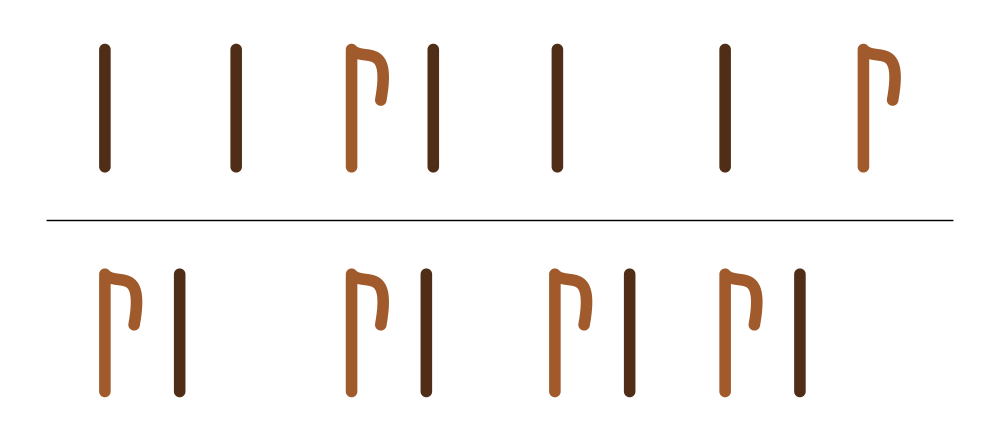

aula 02
====

# {clave ≠ pulso ≠ andamento ≠ agógica} = paisagem

seguindo o mesmo princípio da clave melódica, a clave rítmica vai nos ajudar a organizar ou agrupar os valores rítmicos o entendimento rítmico dentro da música.

> podemos até pensar a clave como um pulso estrutural que vai conduzir a música em suas características agógicas, mas precisamos diferenciar do pulso dentro da acepção convencional.

<iframe width="560" height="315" src="https://www.youtube.com/embed/d2yDN-nN2k0?start=1117" frameborder="0" allow="accelerometer; autoplay; encrypted-media; gyroscope; picture-in-picture" allowfullscreen></iframe>

#### o problema da ~~clave~~

a música ocidental eurocentrica está basicamente orientada pela Semibreve desde o século XIV (*[Ars Nova](https://www.hugoribeiro.com.br/download-textos-pessoais/ars_nova.pdf)*). mas com o passar do tempo, foi-se criando uma mentalidade de pulso dividida em partes binárias (semibreve dividida em 2 mínimas) e abandonando de vez a mentalidade dos [modos rítmicos](https://pt.wikipedia.org/wiki/Modo_r%C3%ADtmico) e [pés-métricos]([https://edisciplinas.usp.br/pluginfile.php/4196181/mod_resource/content/1/ME%CC%81TRICA2.pdf](https://edisciplinas.usp.br/pluginfile.php/4196181/mod_resource/content/1/MÉTRICA2.pdf)).

> <iframe width="560" height="315" src="https://www.youtube.com/embed/Fsys9kRedqI?start=1117" frameborder="0" allow="accelerometer; autoplay; encrypted-media; gyroscope; picture-in-picture" allowfullscreen></iframe>

#### o que é clave?

relação entre sons curtos e sons longos

<iframe width="560" height="315" src="https://www.youtube.com/embed/DUIQlQdED7A" frameborder="0" allow="accelerometer; autoplay; encrypted-media; gyroscope; picture-in-picture" allowfullscreen></iframe>

#### pulso

pulso é movimento. ponto.

#### Andamento

é o caráter semantico da música.

| **Andamento**                                                | **[bpm](https://pt.wikipedia.org/wiki/Batidas_por_minuto)** | **Definição**                                                |
| ------------------------------------------------------------ | ----------------------------------------------------------- | ------------------------------------------------------------ |
| ***Gravissimo***                                             | 19para baixo                                                | Extremamente lento                                           |
| ***Grave***                                                  | 20-40                                                       | lento e solene                                               |
| ***Larghissimo***                                            | 40-45                                                       | lentamente                                                   |
| ***Largo***                                                  | 45-50                                                       | amplamente                                                   |
| ***Larghetto***                                              | 50-55                                                       | Mais amplo que o *Largo*                                     |
| ***[Adagio](https://pt.wikipedia.org/wiki/Adágio_(música))*** | 55-65                                                       | Suave, vagaroso e Imponente                                  |
| ***Adagietto***                                              | 65-69                                                       | Vagarosamente, pouco mais rápido que *Adagio*                |
| ***Andantino***                                              | 78-83                                                       | pouco mais lento que o *Andante*,                            |
| ***Marcia Moderato***                                        | 83-85                                                       | moderamente, á maneira de uma marcha                         |
| ***Andante***                                                | 75-107                                                      | Em ritmo do andar humano, agradável e compassado             |
| ***Andante Moderato***                                       | 90-100                                                      | Entre o andante e o moderato                                 |
| ***Moderato***                                               | 108-112                                                     | Moderadamente (nem rápido, nem lento)                        |
| ***Allegro Moderato***                                       | 112-115                                                     | moderamente rápido                                           |
| ***[Allegro ma non troppo](https://pt.wikipedia.org/wiki/Allegro_ma_non_troppo)*** | 116-119                                                     | Não tão ligeiro como o *Allegro*; também chamado de *Allegretto* |
| ***[Allegro](https://pt.wikipedia.org/wiki/Alegro)***        | 120-139                                                     | Ligeiro e alegre                                             |
| ***[Vivace](https://pt.wikipedia.org/wiki/Vivace)***         | 140-159                                                     | Rápido e vivo                                                |
| ***Vivacissimo***                                            | 160-169                                                     | Mais rápido e vivo que o *Vivace*; também chamado de *molto vivace* |
| ***Alegricissimo***                                          | 168-177                                                     | Rápido e animado                                             |
| ***[Presto](https://pt.wikipedia.org/wiki/Presto)***         | 180-200                                                     | extremamente rápido                                          |
| ***Prestissimo***                                            | 200 ou mais                                                 | Muito rapidamente, com toda a velocidade e presteza          |

*fonte: [Wikipédia](https://pt.wikipedia.org/wiki/Andamento)*

> nisso entra o problema do metrônomo...
>
> <iframe width="560" height="315" src="https://www.youtube.com/embed/-OtqHOJjMIU" frameborder="0" allow="accelerometer; autoplay; encrypted-media; gyroscope; picture-in-picture" allowfullscreen></iframe>

# agógica

agógica é uma dialética musical

> só pra lembrar...
>
> <iframe width="560" height="315" src="https://www.youtube.com/embed/u-fjl3RC3L0?start=1117" frameborder="0" allow="accelerometer; autoplay; encrypted-media; gyroscope; picture-in-picture" allowfullscreen></iframe>

e de lição de casa:

- [Tensão e Relaxamento](https://www.youtube.com/watch?v=quduI1DCPY4)
- [Kiko Freitas falando da música africana](https://www.youtube.com/watch?v=lqz1-DwwsLE)
- [Mathematics of African Dance Rhythms](https://www.youtube.com/watch?v=2TgFp76Rnig&list=PLcWaQtyIPMFbUSduHCqk5yaNqS00VjzJI&index=2&t=5616s)
- [Drum Rhythm Principles of Percussion Polyrhythm from Ghana](https://www.youtube.com/watch?v=yK42w0H8rSU&list=PLcWaQtyIPMFbUSduHCqk5yaNqS00VjzJI&index=2)
