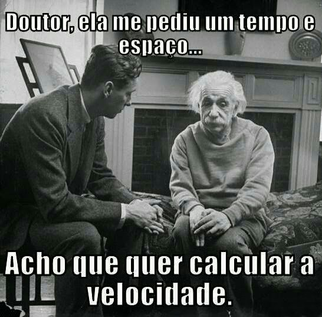

# Fórmula de compasso

---

segundo o Grove

> Na [notação]([https://pt.wikipedia.org/wiki/Nota%C3%A7%C3%A3o_musical](https://pt.wikipedia.org/wiki/Notação_musical)) ocidental são sinais colocados no começo de uma composição, depois da "clave" e qualquer ["armadura de clave"](https://pt.wikipedia.org/wiki/Armadura_(música)), ou no curso da composição. Eles indicam a [métrica](https://pt.wikipedia.org/wiki/Métrica_(música)) da peça ou uma mudança na métrica para uma parte da peça. Num uso moderno são comumente usadas duas figuras, uma acima da outra: a inferior indica a unidade de tempo, relativa à semibreve; a superior indica os tempos do compasso.

### simples assim:

## mas de onde saiu isso? da dança?

pra começar a bagunça...

> A **dança** é uma das três principais [artes cênicas](https://pt.wikipedia.org/wiki/Artes_cênicas) da antiguidade, ao lado do [teatro](https://pt.wikipedia.org/wiki/Teatro) e da [música](https://pt.wikipedia.org/wiki/Música). No [antigo Egito](https://pt.wikipedia.org/wiki/Antigo_Egito) já se realizavam as chamadas danças astro-teológicas em homenagem a [Osíris](https://pt.wikipedia.org/wiki/Osíris). Na [Grécia](https://pt.wikipedia.org/wiki/Grécia), a dança era frequentemente vinculada aos [jogos](https://pt.wikipedia.org/wiki/Jogos_Olímpicos), em especial aos [olímpicos](https://pt.wikipedia.org/wiki/Jogos_Olímpicos).[[1]](https://pt.wikipedia.org/wiki/Dança#cite_note-1) A dança caracteriza-se pelo uso do corpo seguindo movimentos previamente estabelecidos ([coreografia](https://pt.wikipedia.org/wiki/Coreografia)) ou improvisados (dança livre).[[2]](https://pt.wikipedia.org/wiki/Dança#cite_note-2) Na maior parte dos casos, a dança, com passos ritmados ao som e compasso de [música](https://pt.wikipedia.org/wiki/Música) e envolve a expressão de sentimentos potenciados por ela.
>
> A dança pode existir como manifestação artística ou como forma de divertimento ou cerimónia. Atualmente, a dança manifesta-se nas ruas, em eventos como vídeo-clip ou em qualquer outro ambiente em que for contextualizado o propósito artístico.
>
> Fonte: [Dança - Wikipedia]([https://pt.wikipedia.org/wiki/Dan%C3%A7a](https://pt.wikipedia.org/wiki/Dança))

- "potencial revelador do humano" - *a poética do movimento cotidiano*
- o **eu** contraposto ao **si mesmo** - segundo Nietzsche *"a dança envolve uma perda de si e abre para outra possibilidade, o esquecimento de si faz nascer o si mesmo"*, o falável versos o infalável.

#### espaço e corpo

café Filosófico "**o que pode o corpo**" - Dani Lima

<iframe width="560" height="500" src="https://www.youtube.com/embed/d8kSSGX1Ufw" frameborder="0" allow="accelerometer; autoplay; encrypted-media; gyroscope; picture-in-picture" allowfullscreen></iframe>

problemas em "tratados"

> - [Tragédia]([https://pt.wikipedia.org/wiki/Trag%C3%A9dia#Trag%C3%A9dia_grega](https://pt.wikipedia.org/wiki/Tragédia#Tragédia_grega))
>
>   ​	Ésquilo, Sófocles, Eurípedes... Nietzsche
>
>   
>
> - Realismo vs Nominalismo
>
>   
>
> - [*Nātyaśāstra* नाट्य शास्त्र  ](https://pt.wikipedia.org/wiki/Natya_Shastra)
>
>    primeiro tratado escrito em sânscrito sobre dramaturgia e artes correlatas. [outro artigo aqui](http://www.revistafenix.pro.br/PDF9/3.Dossie.Marcus_Mota.pdf)

---

***"Apenas na dança sei falar o símile das coisas mais altas"* - Zaratustra**

---

#### movimento e  gesto

<iframe width="560" height="500" src="https://www.youtube.com/embed/ouYiTiiY3vg" frameborder="0" allow="accelerometer; autoplay; encrypted-media; gyroscope; picture-in-picture" allowfullscreen></iframe>

#### velocidade = respiração

cada categoria de dança propicia respirações diferentes, velocidades diferentes e afetos diferentes

<iframe width="560" height="500" src="https://www.youtube.com/embed/ENXKul5_RQc" frameborder="0" allow="accelerometer; autoplay; encrypted-media; gyroscope; picture-in-picture" allowfullscreen></iframe>

<iframe width="560" height="500" src="https://www.youtube.com/embed/O0Emau_--bY" frameborder="0" allow="accelerometer; autoplay; encrypted-media; gyroscope; picture-in-picture" allowfullscreen></iframe>

