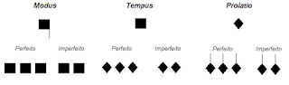
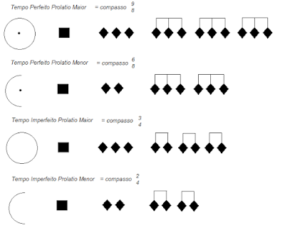
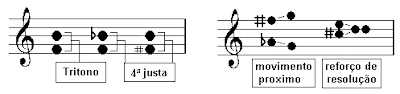
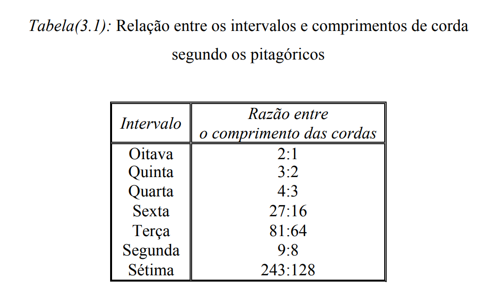

# Prolação

### comecemos...

pela excelente explicação que o Marcelo Ferreira dá no seu [blog](https://parlatoriomusical.blogspot.com/2015/11/seculo-xiv-ars-nov-guillaume-de-machaut.html)

> Ao longo da *Ars Novæ* as medidas de duração das notas se tornaram cada vez mais definidas, assim como as indicações de métrica no início da pauta possibilitando várias combinações entre os valores das notas e os padrões métricos. O pulso básico girava em torno de 80 bpm no metrônomo moderno, mas eram reconhecidas velocidades alternativas como rápido, moderado e lento.
>
> Havia três relações métricas principais nesse período: *Modus*, *Tempus* e *Prolatio*, eram relacionadas às formas perfeitas, imperfeitas e alteradas, resultando em doze esquemas básicos.
>
> ***Modus\*** relacionava a longa com a breve, estava à longa perfeita (27 unidades), longa imperfeita (18 unidades) e a breve (9 unidades); no terceiro grau.
>
> ***Tempus\***, relacionando a breve com a semibreve, estavam a breve perfeita (9 unidades), a breve imperfeita (6 unidades) e a semibreve menor (3 unidades).
>
> ***Prolatio\***, relacionando a semibreve com a mínima, estavam a semibreve perfeita (3 unidades), a semibreve imperfeita (2 unidades) e a mínima (1 unidade).
>
> 

> (...)
>
> Na Idade Média tínhamos duas denominações básicas para as formulas de compasso: "*perfeito*" e "*imperfeito*", elas se referiam às divisões ternárias e binárias respectivamente. Com o passar do tempo se desenvolveu um sistema de sinais que usava círculos e semi-circulos para determinar o numero de Modus; Tempus e Prolatio nas formulas de compasso "*perfeito*" e "*imperfeito*"
>
> 

### Ética *vs* Moral

> ***Musica Ficta***
>
> *Musica Ficta* vem do latim e significa: música falsa ou simulada. Refere-se às alterações cromáticas, que deviam ser realizadas pelo executante. A *musica ficta* era utilizada para evitar intervalos harmônicos ou melódicos indesejáveis, por exemplo, o trítono "diabolus in musica", se empregavam notas fora da escala modal usada na obra. O trítono era inicialmente evitado, pois dificultava a afinação dos cantores, mais tarde, passou a integrar o grupo de intervalos utilizados como uma forma de reforçar o sentido de conclusão de uma melodia. A *musica ficta* era utilizada da seguinte forma: quando em uma voz tínhamos um Fá em outra voz um Si-natural esta nota era alterada para Si-bemol evitando a formação do tritono; ou se alterava uma nota para que ela tomasse a função de sensível na resolução, por exemplo, elevar o Fá-natural para Fá-sustenido para resolver na nota Sol. Estes termos foram adotados pelos teóricos a partir do século XII até o século XVI.
>
> 

## Binário *vs* Ternário

<iframe width="100%" height="394" src="https://musescore.com/user/114360/scores/6316995/embed" frameborder="0" allowfullscreen allow="autoplay; fullscreen"></iframe>
<a href="https://musescore.com/user/114360/scores/6316995/s/OQNUzL" target="_blank">prolatio</a> by <a href="https://musescore.com/user/114360">PandaCosta</a>

#### a relação entre *binário* e *ternário* vai ser sempre uma relação de discurso

<iframe width="560" height="315" src="https://www.youtube.com/embed/oQcQVGEGAGE" frameborder="0" allow="accelerometer; autoplay; encrypted-media; gyroscope; picture-in-picture" allowfullscreen></iframe>

<iframe width="560" height="315" src="https://www.youtube.com/embed/X0z3KuivDow" frameborder="0" allow="accelerometer; autoplay; encrypted-media; gyroscope; picture-in-picture" allowfullscreen></iframe>

<iframe width="560" height="315" src="https://www.youtube.com/embed/MWngCIu6K2Q" frameborder="0" allow="accelerometer; autoplay; encrypted-media; gyroscope; picture-in-picture" allowfullscreen></iframe>

<iframe width="560" height="315" src="https://www.youtube.com/embed/wZlpNvPuPuM" frameborder="0" allow="accelerometer; autoplay; encrypted-media; gyroscope; picture-in-picture" allowfullscreen></iframe>

### e mais WikiPedia

> **Hemíola** (grego ἡμιόλιος, *hemiolios, "contendo um e meio")* é um termo da [musicologia](https://pt.wikipedia.org/wiki/Musicologia) que descreve um padrão rítmico onde dois [compassos](https://pt.wikipedia.org/wiki/Compasso_(música)) ternários são articulados como se houvesse três compassos binários. O termo foi cunhado pelos gregos antigos, significando um-e-meio, referindo-se à proporção 3:2, que equivale à proporção do intervalo de [quinta](https://pt.wikipedia.org/wiki/Quinta_(música)) perfeita. Na [Idade Média](https://pt.wikipedia.org/wiki/Idade_Média) e [Renascimento](https://pt.wikipedia.org/wiki/Renascimento) o conceito foi usado para significar o uso de três [breves](https://pt.wikipedia.org/wiki/Breve) quando o material musical predominante segue um ritmo de duas breves pontuadas em cada compasso.
>
> fonte: [Hemíola](https://pt.wikipedia.org/wiki/Hem%C3%ADola)

e qual a relação disso com melodias, ou são só rítmos?

# nada são só ritmos... nem as melodias!

[PDF] [Matemática e Música, Juliana Juliani](https://www.dm.ufscar.br/~dplm/TGMatematicaMusica.pdf)
