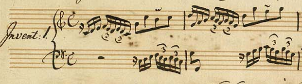
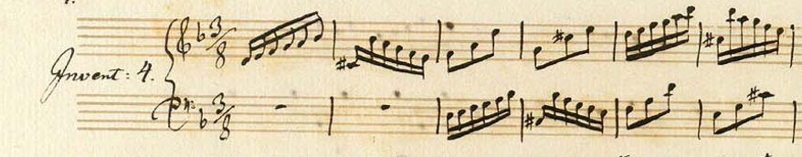
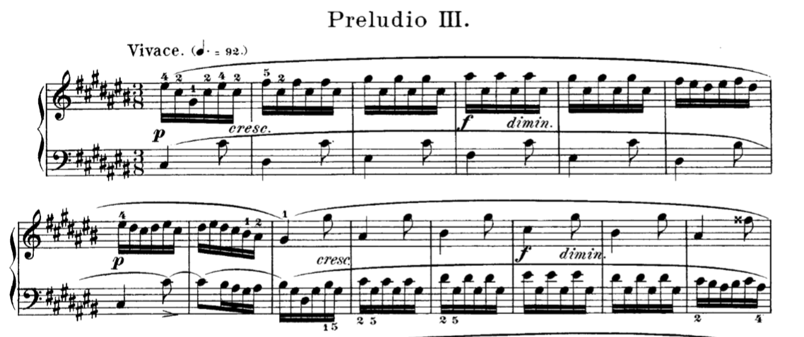
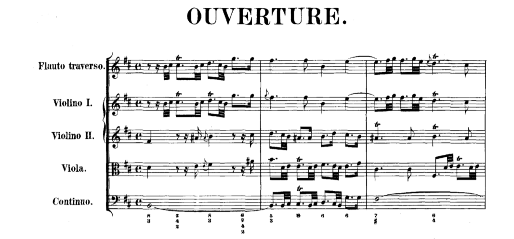
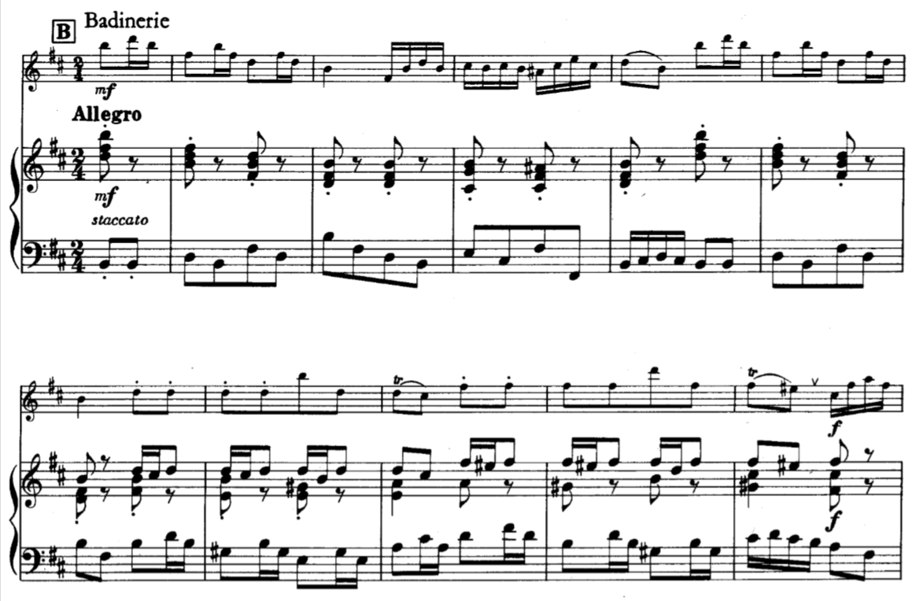
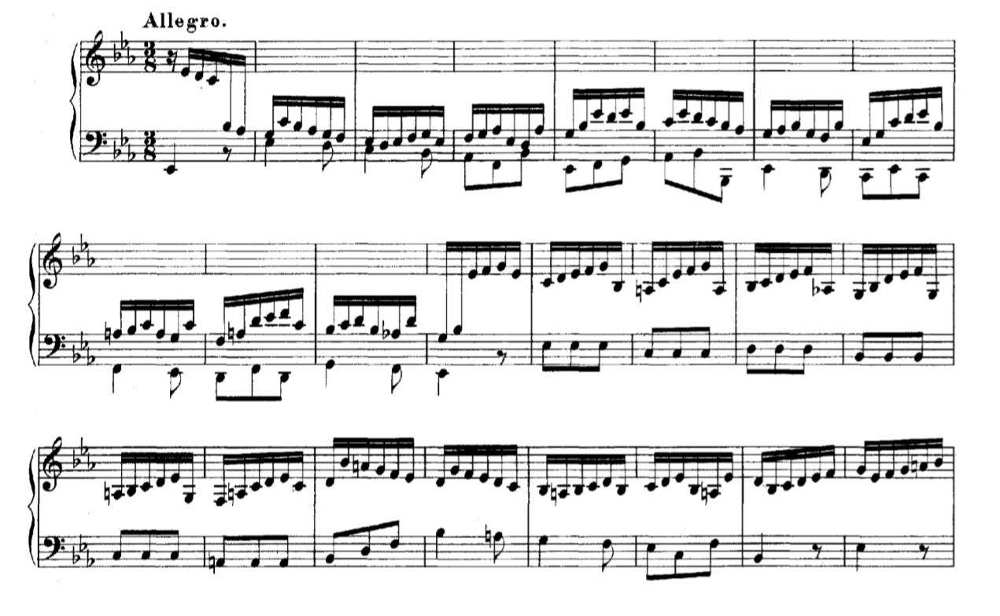

# Figurações

## o que é?

segundo o Grove

> Uma espécie de embelezamento, acompanhamento ou trabalho de passagem medido e contínuo. Em princípio, a figuração é composta de "figuras", ou pequenos padrões de notas que ocupam uma ou duas batidas de tempo; muitas vezes, no entanto, o termo é usado vagamente para trabalhos de passagem não facilmente divisíveis em "figuras", como escalas longas ou arpejos. A figuração às vezes resulta do processo conhecido de várias maneiras como Diminuição, Divisão ou Coloração, §2 - a divisão das notas em figuras que decoram as notas originais com pequenas guirlandas de notas rápidas ou conectam uma nota com a outra; às vezes é composta de fresco para acompanhar uma melodia mais lenta ou para mostrar o virtuosismo de um solista.

<iframe width="560" height="500" src="https://www.youtube.com/embed/Y7c0RINmFe0" frameborder="0" allow="accelerometer; autoplay; encrypted-media; gyroscope; picture-in-picture" allowfullscreen></iframe>

<iframe width="560" height="500" src="https://www.youtube.com/embed/VQ-Q2urb3xI" frameborder="0" allow="accelerometer; autoplay; encrypted-media; gyroscope; picture-in-picture" allowfullscreen></iframe>

## então as coisas se repetem...

<iframe width="560" height="315" src="https://www.youtube.com/embed/eVkNc3LSgOo" frameborder="0" allow="accelerometer; autoplay; clipboard-write; encrypted-media; gyroscope; picture-in-picture" allowfullscreen></iframe>

<iframe width="560" height="315" src="https://www.youtube.com/embed/vg4ytXm1Tbc" frameborder="0" allow="accelerometer; autoplay; clipboard-write; encrypted-media; gyroscope; picture-in-picture" allowfullscreen></iframe>

> partitura e gravação das 15 invenções:
>
> [Partitura IMSLP](http://ks4.imslp.info/files/imglnks/usimg/f/fb/IMSLP467846-PMLP3267-15_Inventio_Manoscritto.pdf)
>
> <iframe width="560" height="315" src="https://www.youtube.com/embed/sdaCRiSqfjM" frameborder="0" allow="accelerometer; autoplay; clipboard-write; encrypted-media; gyroscope; picture-in-picture" allowfullscreen></iframe>

<iframe width="560" height="315" src="https://www.youtube.com/embed/d_DFyOgtCzw" frameborder="0" allow="accelerometer; autoplay; clipboard-write; encrypted-media; gyroscope; picture-in-picture" allowfullscreen></iframe>

> Partitura e gravação Suíte Orquestral No.2:
>
> [paritura IMSLP](https://imslp.simssa.ca/files/imglnks/usimg/4/48/IMSLP16317-Bach_-_Orchestral_Suite_No.2_Dover.pdf)
>
> <iframe width="560" height="315" src="https://www.youtube.com/embed/x8Rv9ppP6A8" frameborder="0" allow="accelerometer; autoplay; clipboard-write; encrypted-media; gyroscope; picture-in-picture" allowfullscreen></iframe>

<iframe width="560" height="315" src="https://www.youtube.com/embed/X6NaUsWK0es" frameborder="0" allow="accelerometer; autoplay; clipboard-write; encrypted-media; gyroscope; picture-in-picture" allowfullscreen></iframe>