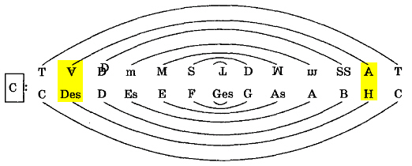
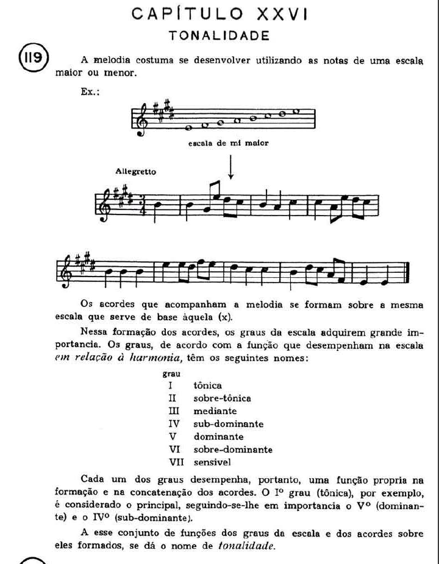
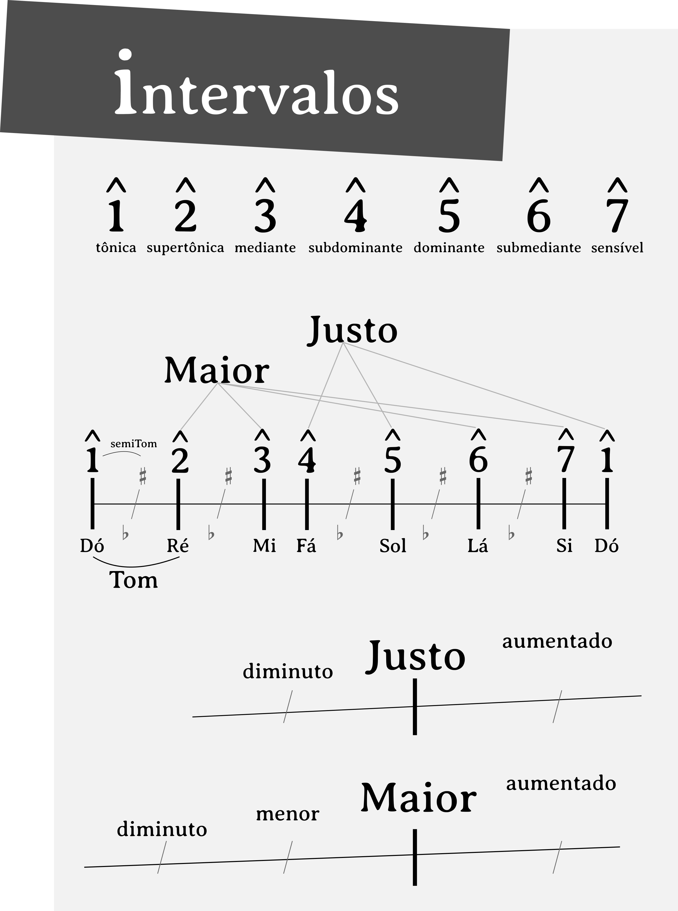

# 3ª sobe e 7ª desce

### comecemos pela mão:

<iframe width="560" height="315" src="https://www.youtube.com/embed/_8lpHTSOPeU" frameborder="0" allow="accelerometer; autoplay; clipboard-write; encrypted-media; gyroscope; picture-in-picture" allowfullscreen></iframe>

### tomemos, então, alguns saltos lógicos:

**série harmônica -> escala diastêmica [modos] -> escala diatônica [tonalidade] -> intervalos**

<iframe width="100%" height="394" src="https://musescore.com/user/114360/scores/6440826/embed" frameborder="0" allowfullscreen allow="autoplay; fullscreen"></iframe>
<a href="https://musescore.com/user/114360/scores/6440826/s/zDa8V3" target="_blank">Série_Harmônica</a> by <a href="https://musescore.com/epandacosta">PandaCosta</a>

<iframe width="100%" height="394" src="https://musescore.com/user/114360/scores/6440858/embed" frameborder="0" allowfullscreen allow="autoplay; fullscreen"></iframe>
<a href="https://musescore.com/user/114360/scores/6440858/s/raVkBE" target="_blank">Modos_-_gregos__-</a> by <a href="https://musescore.com/epandacosta">PandaCosta</a>

> ### Modos Gregos?

> sobre os modos gregos é legal nos enganarmos assim:
>
> Historicamente, os modos eram usados especialmente na [música](https://pt.wikipedia.org/wiki/Música) [litúrgica](https://pt.wikipedia.org/wiki/Litúrgica) da [Idade Média](https://pt.wikipedia.org/wiki/Idade_Média), sendo que poderíamos também classificá-los como modos "litúrgicos" ou "eclesiásticos".
>
> Existem historiadores que preferem ainda nomeá-los como "modos gregorianos" por terem sido organizados, também, pelo papa [Gregório I](https://pt.wikipedia.org/wiki/Gregório_Magno), quando este se preocupou em organizar a música na [liturgia](https://pt.wikipedia.org/wiki/Liturgia) de sua época. Outros nomes são "modos litúrgicos" ou "modos eclesiásticos". Segundo alguns esses nomes são preferíveis porque foi descoberto que os modos gregos na [antiga](https://pt.wikipedia.org/wiki/Antiguidade_clássica) Grécia não eram os mesmos como os modos na época medieval até hoje.
>
> [Modos Gregos - Wikipedia](https://pt.wikipedia.org/wiki/Modos_gregos)

> mas a verdade sobre os modos gregos...
>
> <iframe width="560" height="315" src="https://www.youtube.com/embed/Ycc_Dq7R9QE" frameborder="0" allow="accelerometer; autoplay; clipboard-write; encrypted-media; gyroscope; picture-in-picture" allowfullscreen></iframe>

​    

  

  ### Tonalidade

  

___

**é de muito bom grado dar uma olhada aqui tbm:**
<a href="https://ecostaribeiro.tumblr.com/post/141030391944/ensaios-sobre-teoria"> Ensaio 003</a> | <a href="https://ecostaribeiro.tumblr.com/post/141428579154/ensaios-sobre-teoria-004"> Ensaio 004</a> | <a href="https://ecostaribeiro.tumblr.com/post/141929830899/ensaios-sobre-teoria-005"> Ensaio 005</a>

---

  

​    

### intervalos

